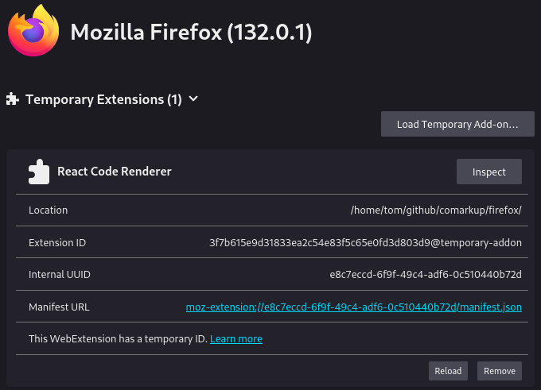

# firefox

Firefox plugin zawiera następujące funkcjonalności:

1. Automatyczna detekcja kodu React:
    - Skanuje stronę co 2 sekundy w poszukiwaniu elementów `<pre>` i `<code>`
    - Wykrywa kod React na podstawie charakterystycznych słów kluczowych
    - Dodaje przycisk "Renderuj" tylko do fragmentów zawierających kod React

2. Renderowanie kodu:
    - Po kliknięciu przycisku "Renderuj" otwiera się popup
    - Popup zawiera wyrenderowaną wersję komponentu React
    - Wykorzystuje React, ReactDOM i Babel do kompilacji i renderowania

3. Dodatkowe funkcje:
    - Możliwość kopiowania wyrenderowanego HTML do schowka
    - Obsługa błędów renderowania
    - Przycisk zamykania popupu

## Instalacja

Aby zainstalować plugin:

1. Utwórz nowy folder dla pluginu
2. Skopiuj powyższy kod do odpowiednich plików (manifest.json i content.js)
3. Pobierz wymagane biblioteki:
    - react.development.js
    - react-dom.development.js
    - babel.min.js
```bash
# 2. Pobierz wymagane biblioteki:
curl -O https://unpkg.com/react@17/umd/react.development.js
curl -O https://unpkg.com/react-dom@17/umd/react-dom.development.js
curl -O https://unpkg.com/babel-standalone@6/babel.min.js
```

4. W Firefox przejdź do about:debugging
```
open about:debugging
```

5. Kliknij "This Firefox"
6. Kliknij "Load Temporary Add-on"
7. Wybierz manifest.json z utworzonego folderu




## Publikacja

Aby opublikować na Firefox Marketplace:

1. Przygotuj paczkę:
- Stwórz plik zip zawierający wszystkie pliki pluginu
- Dodaj zrzuty ekranu pluginu w akcji
- Przygotuj ikonę w rozmiarach 48x48, 96x96 i 128x128 px

2. Utwórz konto developerskie:
- Wejdź na https://addons.mozilla.org/developers/
- Zarejestruj się jako developer

3. Prześlij dodatek:
- Zaloguj się na konto developerskie
- Kliknij "Submit a New Add-on"
- Wybierz "Upload Your Add-on"
- Prześlij przygotowany plik zip


```plaintext
Nazwa: React Code Renderer
Kategoria: Developer Tools
Opis: 
Narzędzie dla programistów pozwalające na renderowanie kodu React znalezionego na stronach internetowych. Automatycznie wykrywa fragmenty kodu React i dodaje przycisk umożliwiający podgląd wyrenderowanego komponentu w osobnym oknie.

Funkcje:
- Automatyczna detekcja kodu React
- Podgląd wyrenderowanych komponentów
- Kopiowanie do schowka
- Obsługa błędów renderowania

Tags: React, JavaScript, Developer Tools, Code Preview
```


7. Po przesłaniu:
- Mozilla zweryfikuje kod (zazwyczaj 1-2 tygodnie)
- Możesz otrzymać prośby o poprawki
- Po akceptacji dodatek pojawi się w marketplace

8. Aktualizacje:
- Zwiększ numer wersji w manifest.json
- Prześlij nową paczkę zip
- Opisz zmiany w changelugu

Wskazówki dla szybszej akceptacji:
1. Dokładnie testuj przed wysłaniem
2. Pisz czysty, dobrze udokumentowany kod
3. Unikaj zewnętrznych zależności
4. Jasno opisz wszystkie wymagane uprawnienia
5. Dołącz szczegółowe instrukcje testowania
6. Szybko odpowiadaj na pytania recenzentów

